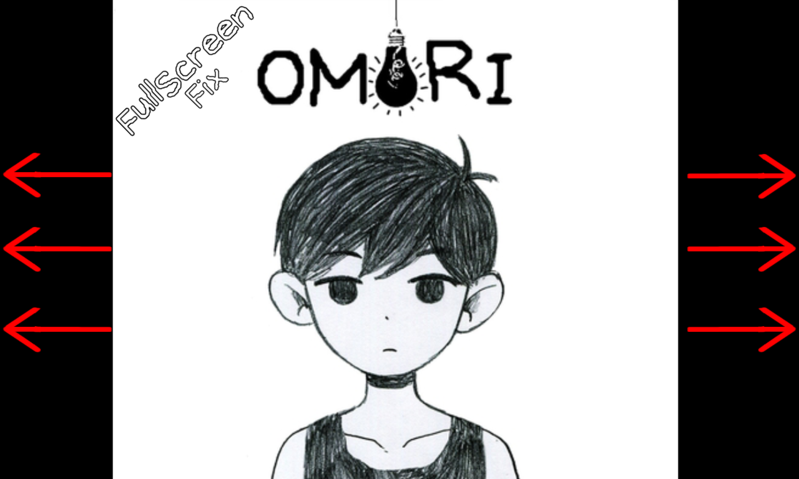
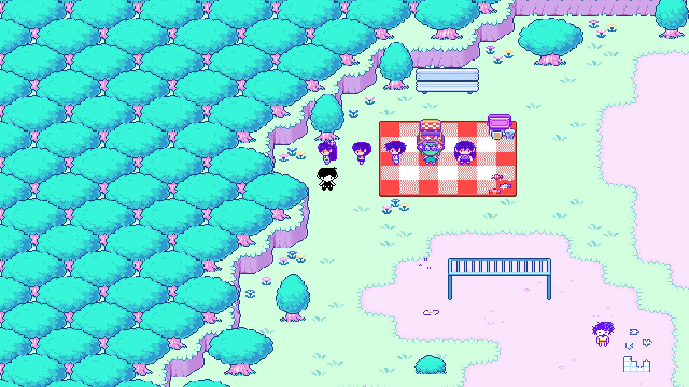

# Omori-FullScreenFix

A simple and lightweight fix that removes black bars and forces **OMORI** to run in true fullscreen mode, adapting to your screen's native resolution.

## 📖 About The Mod

Tired of playing OMORI with black borders on the sides of your screen? This mod patches the game's rendering to eliminate those black bars, providing a seamless fullscreen experience across all modern displays.

-   **Forces true fullscreen:** No more borderless windowed mode with black bars.

## 📸 Screenshots

## ⚙️ Installation

1.  **Download** the latest version of the mod from the [Releases](https://github.com/NotKurator/Omori-FullScreenFix/releases) page.
2.  Navigate to your OMORI game folder (where `OMORI.exe` is located).
3.  Open Folder "www" --> "mods"
4.  Copy Arhive to mods folder.
5.  Run the game. The black bars should be gone.

## 📜 License

This mod is protected under a custom license. You are free to download, use, and share it, but you may not modify its files or claim it as your own work.

Please see the [LICENSE](LICENSE) file for the full terms and conditions.

## ⚠️ Disclaimer

This is a modification for OMORI. OMORI is a trademark of OMOCAT, LLC..
